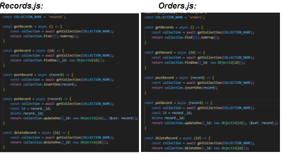
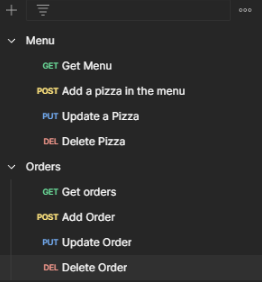
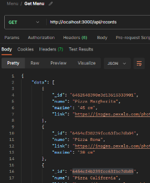
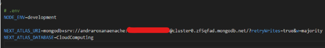
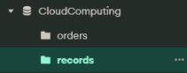
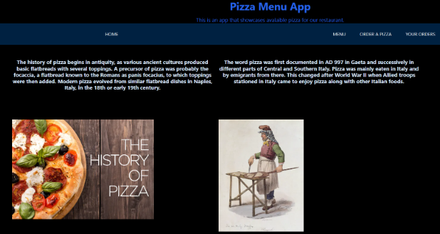
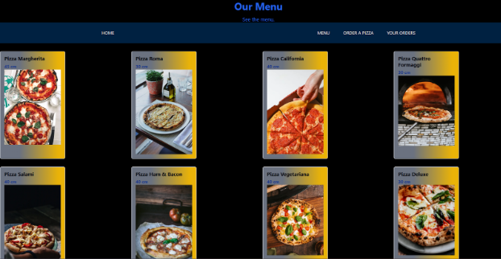
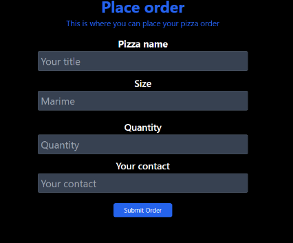
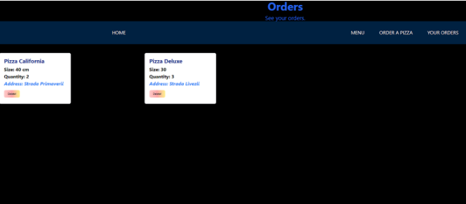

# Introducere #

Aplicația ___„Pizza Menu App”___ pune la dispozitie clientilor unui restaurant de pizza meniul disponibil si posibilitatea de a comanda una chiar la ei acasa, totodata de a si vizualiza comenzile sale.
Informațiile furnizate in aplicație se preiau din cadrul unei baze de date remote care functioneaza  in cloud, __MONGODB__.
Pentru realizarea Backend-ului am folosit NextJS cu ajutorul unui server express împreuna cu un API cu care sunt realizate operațiile CRUD pe aceasta  baza de date, iar front-end-ul este realizat in __React__.
Aplicatia finala a fost publicata cu ajutorul unei platforme in cloud, __VERCEL__.
# Descriere tehnologii cloud folosite #

## MONGODB API: ##
Baza de date este salvată în cloud și pentru aceasta am ales __MONGODB__. 
Cu ajutorul ei clienții pot adăuga pizza în comanda lor într-o colecție pe care o putem accesa ulterior pentru a obține detaliile comenzilor. Este facilitata, de asemenea ștergerea unei comenzi din baza de date în cazul în care clienților dorește asta.
Aceleași posibilități sunt furnizate și pentru vizualizarea meniului disponibil la restaurant.
Pentru a realiza aceste operatii CRUD pe baza de date am scris 2 routere, fiecare cu cate 4 metode: 1 de tip __GET__, 1 de tip __POST__, 1 de tip __PUT__ si 1 de tip __DELETE__.

# Metodele HTTP din API-ul pentru comunicarea cu baza de date #

* Pentru Meniul disponibil al restaurantului:

_Metoda Get Menu_ nu primeste niciun parametru sau body si intoarce meniul de pizza 
salvat in baza de date.

_Metoda Add a pizza in the Menu_ primeste prin intermediul body-ului 3 informatii: nume, marime si link-ul catre o imagine reprezentativa, iar pe baza acestora creaza un nou document pe care il adauga in colectia din baza de date.

_Metoda Update Pizza_  primeste ca parametrul id-ul unui element din meniu care va fi modificat in colectia din baza de date.

_Metoda Delete Pizza_  primeste ca parametrul id-ul unui element din meniu care va fi sters din colectia din baza de date.

* Pentru comenzile clientului:

_Metoda Get Orders_ nu primeste niciun parametru sau body si intoarce comenzile
salvate in baza de date.

_Metoda Add Order_ primeste prin intermediul body-ului 4 informatii: nume, marime, cantitatea dorita si informatiile de contact ale clientului, iar pe baza acestora creaza un nou document pe care il adauga in colectia din baza de date.

_Metoda Update Order_ primeste ca parametrul id-ul unui element din comanda care va fi modificat în colecția din baza de date.

_Metoda Delete Order_ primeste ca parametrul id-ul unei comenzi care va fi ștearsă din colecția din baza de date.

# Autentificare și autorizare servicii utilizate #
Conexiunea si utilizarea bazei de date in cloud MongoDB are nevoie de o cheie unica generata _(NEXT_ATLAS_URI)_ la crearea bazei de date in MongoDb Atlas ce este alcatuita din username si parola furnizata care este ascunsa in imaginea de mai jos, dar necesita totodata si numele bazei de date _(NEXT_ATLAS_DATABASE)_. Aceste informatii sunt salvate in folderul .env din cadrul front-end-ului.

Colectiile orders si records din baza de date CloudComputing:

# Capturi ecran aplicație #
### Pagina initiala

### Vizualizarea meniului

### Plasarea unei comenzi

### Vizualizarea comenzilor

# Referinte #

_Link-ul public catre aplicatie:_ https://cc-pizza-5prlmic23-andraroxana19.vercel.app

_Link demo aplicatie YouTube:_ https://youtu.be/aRyoaP20YoQ

